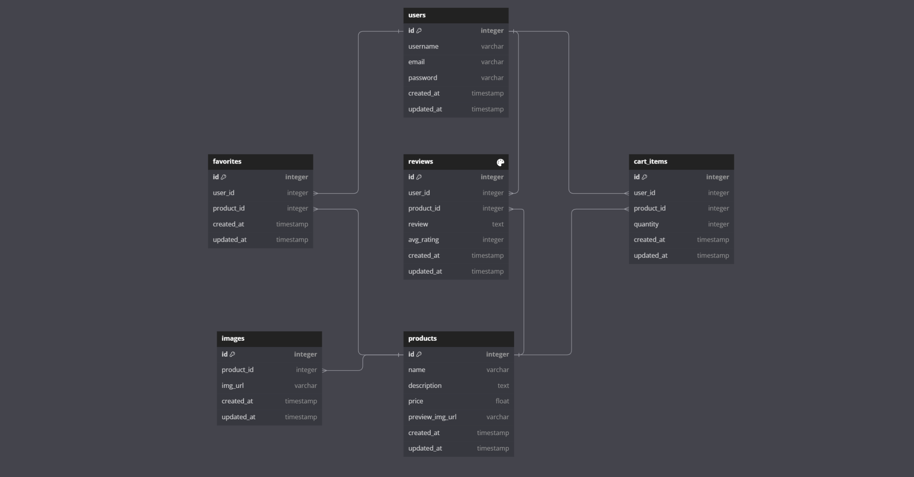

# EpicBuy
[LiveLink](https://epicbuy.onrender.com)
## Database Schema Design


# API Documentation - EpicBuy

## USER AUTHENTICATION/AUTHORIZATION

### All endpoints that require authentication

All endpoints that require a current user to be logged in.

- Request: endpoints that require authentication
- Error Response: Require authentication

  - Status Code: 401
  - Headers:
    - Content-Type: application/json
  - Body:

    ```json
    {
      "message": "Authentication required"
    }
    ```

### All endpoints that require proper authorization

All endpoints that require authentication and the current user does not have the
correct role(s) or permission(s).

- Request: endpoints that require proper authorization
- Error Response: Require proper authorization

  - Status Code: 403
  - Headers:
    - Content-Type: application/json
  - Body:

    ```json
    {
      "message": "Forbidden"
    }
    ```

### Get the Current User

Returns the information about the current user that is logged in.

- Require Authentication: false
- Request

  - Method: GET
  - URL: /api/session
  - Body: none

- Successful Response when there is a logged in user

  - Status Code: 200
  - Headers:
    - Content-Type: application/json
  - Body:

    ```json
    {
      "user": {
        "id": 1,
        "first_name": "John",
        "last_name": "Smith",
        "email": "john.smith@gmail.com",
        "username": "JohnSmith"
      }
    }
    ```

- Successful Response when there is no logged in user

  - Status Code: 200
  - Headers:
    - Content-Type: application/json
  - Body:

    ```json
    {
      "user": null
    }
    ```

### Log In a User

Logs in a current user with valid credentials and returns the current user's
information.

- Require Authentication: false
- Request

  - Method: POST
  - URL: /api/session
  - Headers:
    - Content-Type: application/json
  - Body:

    ```json
    {
      "credential": "john.smith@gmail.com",
      "password": "secret password"
    }
    ```

- Successful Response

  - Status Code: 200
  - Headers:
    - Content-Type: application/json
  - Body:

    ```json
    {
      "user": {
        "id": 1,
        "first_name": "John",
        "last_name": "Smith",
        "email": "john.smith@gmail.com",
        "username": "JohnSmith"
      }
    }
    ```

- Error Response: Invalid credentials

  - Status Code: 401
  - Headers:
    - Content-Type: application/json
  - Body:

    ```json
    {
      "message": "Invalid credentials"
    }
    ```

- Error response: Body validation errors

  - Status Code: 400
  - Headers:
    - Content-Type: application/json
  - Body:

    ```json
    {
      "message": "Bad Request",
      "errors": {
        "credential": "Email or username is required",
        "password": "Password is required"
      }
    }
    ```

### Sign Up a User

Creates a new user, logs them in as the current user, and returns the current
user's information.

- Require Authentication: false
- Request

  - Method: POST
  - URL: /api/users
  - Headers:
    - Content-Type: application/json
  - Body:

    ```json
    {
      "first_name": "John",
      "last_name": "Smith",
      "email": "john.smith@gmail.com",
      "username": "JohnSmith",
      "password": "secret password"
    }
    ```

- Successful Response

  - Status Code: 200
  - Headers:
    - Content-Type: application/json
  - Body:

    ```json
    {
      "user": {
        "id": 1,
        "first_name": "John",
        "last_name": "Smith",
        "email": "john.smith@gmail.com",
        "username": "JohnSmith"
      }
    }
    ```

- Error response: User already exists with the specified email

  - Status Code: 500
  - Headers:
    - Content-Type: application/json
  - Body:

    ```json
    {
      "message": "User already exists",
      "errors": {
        "email": "User with that email already exists"
      }
    }
    ```

- Error response: User already exists with the specified username

  - Status Code: 500
  - Headers:
    - Content-Type: application/json
  - Body:

    ```json
    {
      "message": "User already exists",
      "errors": {
        "username": "User with that username already exists"
      }
    }
    ```

- Error response: Body validation errors

  - Status Code: 400
  - Headers:
    - Content-Type: application/json
  - Body:

    ```json
    {
      "message": "Bad Request",
      "errors": {
        "email": "Invalid email",
        "username": "Username is required",
        "first_name": "First name is required",
        "last_name": "Last name is required"
      }
    }
    ```

## PRODUCTS

### Get all Products

Returns all the products.

- Require Authentication: false
- Request

  - Method: GET
  - URL: /api/products
  - Body: none

- Successful Response

  - Status Code: 200
  - Headers:
    - Content-Type: application/json
  - Body:

    ```json
    {
      "products": [
        {
          "id": 1,
          "owner_id": 1,
          "name": "iPhone 13",
          "description": "Latest Apple smartphone",
          "price": 999,
          "created_at": "2021-11-19 20:39:36",
          "updated_at": "2021-11-19 20:39:36",
          "avg_rating": 4.5,
          "preview_image": "image_url"
        }
      ]
    }
    ```

### Get all Products owned by the Current User

Returns all the products owned (created) by the current user.

- Require Authentication: true
- Request

  - Method: GET
  - URL: /api/products/current
  - Body: none

- Successful Response

  - Status Code: 200
  - Headers:
    - Content-Type: application/json
  - Body:

    ```json
    {
      "products": [
        {
          "id": 1,
          "owner_id": 1,
          "name": "MacBook Pro",
          "description": "High-performance laptop from Apple",
          "price": 1999,
          "created_at": "2021-11-19 20:39:36",
          "updated_at": "2021-11-19 20:39:36",
          "avg_rating": 4.8,
          "preview_image": "image_url"
        }
      ]
    }
    ```

### Get details of a Product from an id

Returns the details of a product specified by its id.

- Require Authentication: false
- Request

  - Method: GET
  - URL: /api/products/:product_id
  - Body: none

- Successful Response

  - Status Code: 200
  - Headers:
    - Content-Type: application/json
  - Body:

    ```json
    {
      "id": 1,
      "owner_id": 1,
      "name": "Apple Watch Series 6",
      "description": "Smartwatch with fitness tracking",
      "price": 399,
      "created_at": "2021-11-19 20:39:36",
      "updated_at": "2021-11-19 20:39:36",
      "num_reviews": 10,
      "avg_star_rating": 4.7,
      "product_images": [
        {
          "id": 1,
          "url": "image_url",
          "preview": true
        },
        {
          "id": 2,
          "url": "image_url",
          "preview": false
        }
      ],
      "owner": {
        "id": 1,
        "first_name": "John",
        "last_name": "Smith"
      }
    }
    ```

- Error response: Couldn't find a Product with the specified id

  - Status Code: 404
  - Headers:
    - Content-Type: application/json
  - Body:

    ```json
    {
      "message": "Product couldn't be found"
    }
    ```

### Create a Product

Creates and returns a new product.

- Require Authentication: true
- Request

  - Method: POST
  - URL: /api/products
  - Headers:
    - Content-Type: application/json
  - Body:

    ```json
    {
      "name": "iPad Pro",
      "description": "Powerful tablet from Apple",
      "price": 799
    }
    ```

- Successful Response

  - Status Code: 201
  - Headers:
    - Content-Type: application/json
  - Body:

    ```json
    {
      "id": 1,
      "owner_id": 1,
      "name": "iPad Pro",
      "description": "Powerful tablet from Apple",
      "price": 799,
      "created_at": "2021-11-19 20:39:36",
      "updated_at": "2021-11-19 20:39:36"
    }
    ```

- Error Response: Body validation errors

  - Status Code: 400
  - Headers:
    - Content-Type: application/json
  - Body:

    ```json
    {
      "message": "Bad Request",
      "errors": {
        "name": "Name is required",
        "description": "Description is required",
        "price": "Price must be a positive number"
      }
    }
    ```

### Add an Image to a Product based on the Product's id

Create and return a new image for a product specified by id.

- Require Authentication: true
- Require proper authorization: Product must belong to the current user
- Request

  - Method: POST
  - URL: /api/products/:product_id/images
  - Headers:
    - Content-Type: application/json
  - Body:

    ```json
    {
      "url": "image_url",
      "preview": true
    }
    ```

- Successful Response

  - Status Code: 200
  - Headers:
    - Content-Type: application/json
  - Body:

    ```json
    {
      "id": 1,
      "url": "image_url",
      "preview": true
    }
    ```

- Error response: Couldn't find a Product with the specified id

  - Status Code: 404
  - Headers:
    - Content-Type: application/json
  - Body:

    ```json
    {
      "message": "Product couldn't be found"
    }
    ```

### Edit a Product

Updates and returns an existing product.

- Require Authentication: true
- Require proper authorization: Product must belong to the current user
- Request

  - Method: PUT
  - URL: /api/products/:product_id
  - Headers:
    - Content-Type: application/json
  - Body:

    ```json
    {
      "name": "MacBook Air",
      "description": "Lightweight laptop from Apple",
      "price": 999
    }
    ```

- Successful Response

  - Status Code: 200
  - Headers:
    - Content-Type: application/json
  - Body:

    ```json
    {
      "id": 1,
      "owner_id": 1,
      "name": "MacBook Air",
      "description": "Lightweight laptop from Apple",
      "price": 999,
      "created_at": "2021-11-19 20:39:36",
      "updated_at": "2021-11-20 10:06:40"
    }
    ```

- Error Response: Body validation errors

  - Status Code: 400
  - Headers:
    - Content-Type: application/json
  - Body:

    ```json
    {
      "message": "Bad Request",
      "errors": {
        "name": "Name is required",
        "description": "Description is required",
        "price": "Price must be a positive number"
      }
    }
    ```

- Error response: Couldn't find a Product with the specified id

  - Status Code: 404
  - Headers:
    - Content-Type: application/json
  - Body:

    ```json
    {
      "message": "Product couldn't be found"
    }
    ```

### Delete a Product

Deletes an existing product.

- Require Authentication: true
- Require proper authorization: Product must belong to the current user
- Request

  - Method: DELETE
  - URL: /api/products/:product_id
  - Body: none

- Successful Response

  - Status Code: 200
  - Headers:
    - Content-Type: application/json
  - Body:

    ```json
    {
      "message": "Successfully deleted"
    }
    ```

- Error response: Couldn't find a Product with the specified id

  - Status Code: 404
  - Headers:
    - Content-Type: application/json
  - Body:

    ```json
    {
      "message": "Product couldn't be found"
    }
    ```

## REVIEWS

### Get all Reviews of the Current User

Returns all the reviews written by the current user.

- Require Authentication: true
- Request

  - Method: GET
  - URL: /api/reviews/current
  - Body: none

- Successful Response

  - Status Code: 200
  - Headers:
    - Content-Type: application/json
  - Body:

    ```json
    {
      "reviews": [
        {
          "id": 1,
          "user_id": 1,
          "product_id": 1,
          "review": "This product is amazing!",
          "stars": 5,
          "created_at": "2021-11-19 20:39:36",
          "updated_at": "2021-11-19 20:39:36",
          "user": {
            "id": 1,
            "first_name": "John",
            "last_name": "Smith"
          },
          "product": {
            "id": 1,
            "owner_id": 1,
            "name": "iPhone 13",
            "description": "Latest Apple smartphone",
            "price": 999,
            "preview_image": "image_url"
          },
          "review_images": [
            {
              "id": 1,
              "url": "image_url"
            }
          ]
        }
      ]
    }
    ```

### Get all Reviews by a Product's id

Returns all the reviews that belong to a product specified by id.

- Require Authentication: false
- Request

  - Method: GET
  - URL: /api/products/:product_id/reviews
  - Body: none

- Successful Response

  - Status Code: 200
  - Headers:
    - Content-Type: application/json
  - Body:

    ```json
    {
      "reviews": [
        {
          "id": 1,
          "user_id": 1,
          "product_id": 1,
          "review": "This product is amazing!",
          "stars": 5,
          "created_at": "2021-11-19 20:39:36",
          "updated_at": "2021-11-19 20:39:36",
          "user": {
            "id": 1,
            "first_name": "John",
            "last_name": "Smith"
          },
          "review_images": [
            {
              "id": 1,
              "url": "image_url"
            }
          ]
        }
      ]
    }
    ```

- Error response: Couldn't find a Product with the specified id

  - Status Code: 404
  - Headers:
    - Content-Type: application/json
  - Body:

    ```json
    {
      "message": "Product couldn't be found"
    }
    ```

### Create a Review for a Product based on the Product's id

Create and return a new review for a product specified by id.

- Require Authentication: true
- Request

  - Method: POST
  - URL: /api/products/:product_id/reviews
  - Headers:
    - Content-Type: application/json
  - Body:

    ```json
    {
      "review": "This product is amazing!",
      "stars": 5
    }
    ```

- Successful Response

  - Status Code: 201
  - Headers:
    - Content-Type: application/json
  - Body:

    ```json
    {
      "id": 1,
      "user_id": 1,
      "product_id": 1,
      "review": "This product is amazing!",
      "stars": 5,
      "created_at": "2021-11-19 20:39:36",
      "updated_at": "2021-11-19 20:39:36"
    }
    ```

- Error Response: Body validation errors

  - Status Code: 400
  - Headers:
    - Content-Type: application/json
  - Body:

    ```json
    {
      "message": "Bad Request",
      "errors": {
        "review": "Review text is required",
        "stars": "Stars must be an integer from 1 to 5"
      }
    }
    ```

- Error response: Couldn't find a Product with the specified id

  - Status Code: 404
  - Headers:
    - Content-Type: application/json
  - Body:

    ```json
    {
      "message": "Product couldn't be found"
    }
    ```

- Error response: Review from the current user already exists for the Product

  - Status Code: 500
  - Headers:
    - Content-Type: application/json
  - Body:

    ```json
    {
      "message": "User already has a review for this product"
    }
    ```

### Add an Image to a Review based on the Review's id

Create and return a new image for a review specified by id.

- Require Authentication: true
- Require proper authorization: Review must belong to the current user
- Request

  - Method: POST
  - URL: /api/reviews/:review_id/images
  - Headers:
    - Content-Type: application/json
  - Body:

    ```json
    {
      "url": "image_url"
    }
    ```

- Successful Response

  - Status Code: 200
  - Headers:
    - Content-Type: application/json
  - Body:

    ```json
    {
      "id": 1,
      "url": "image_url"
    }
    ```
- Error response: Couldn't find a Review with the specified id

 - Status Code: 404

 - Headers:
    - Content-Type: application/json
 - Body:

   ```json
   {
      "message": "Review couldn't be found"
   }
   ```

### Edit a Review

Updates and returns an existing review.

- Require Authentication: true
- Require proper authorization: Review must belong to the current user
- Request

  - Method: PUT
  - URL: /api/reviews/:review_id
  - Headers:
    - Content-Type: application/json
  - Body:

    ```json
    {
      "review": "This product is fantastic!",
      "stars": 4
    }
    ```

- Successful Response

  - Status Code: 200
  - Headers:
    - Content-Type: application/json
  - Body:

    ```json
    {
      "id": 1,
      "user_id": 1,
      "product_id": 1,
      "review": "This product is fantastic!",
      "stars": 4,
      "created_at": "2021-11-19 20:39:36",
      "updated_at": "2021-11-20 10:06:40"
    }
    ```

- Error Response: Body validation errors

  - Status Code: 400
  - Headers:
    - Content-Type: application/json
  - Body:

    ```json
    {
      "message": "Bad Request",
      "errors": {
        "review": "Review text is required",
        "stars": "Stars must be an integer from 1 to 5"
      }
    }
    ```

- Error response: Couldn't find a Review with the specified id

  - Status Code: 404
  - Headers:
    - Content-Type: application/json
  - Body:

    ```json
    {
      "message": "Review couldn't be found"
    }
    ```

### Delete a Review

Deletes an existing review.

- Require Authentication: true
- Require proper authorization: Review must belong to the current user
- Request

  - Method: DELETE
  - URL: /api/reviews/:review_id
  - Body: none

- Successful Response

  - Status Code: 200
  - Headers:
    - Content-Type: application/json
  - Body:

    ```json
    {
      "message": "Successfully deleted"
    }
    ```

- Error response: Couldn't find a Review with the specified id

  - Status Code: 404
  - Headers:
    - Content-Type: application/json
  - Body:

    ```json
    {
      "message": "Review couldn't be found"
    }
    ```

## SHOPPING CART

### Get all Cart Items of the Current User

Returns all the cart items of the current user.

- Require Authentication: true
- Request

  - Method: GET
  - URL: /api/cart
  - Body: none

- Successful Response

  - Status Code: 200
  - Headers:
    - Content-Type: application/json
  - Body:

    ```json
    {
      "cart_items": [
        {
          "id": 1,
          "user_id": 1,
          "product_id": 1,
          "quantity": 2,
          "created_at": "2021-11-19 20:39:36",
          "updated_at": "2021-11-19 20:39:36",
          "product": {
            "id": 1,
            "name": "iPhone 13",
            "price": 999,
            "preview_image": "image_url"
          }
        }
      ]
    }
    ```

### Add a Product to the Cart

Adds a product to the current user's cart.

- Require Authentication: true
- Request

  - Method: POST
  - URL: /api/cart
  - Headers:
    - Content-Type: application/json
  - Body:

    ```json
    {
      "product_id": 1,
      "quantity": 2
    }
    ```

- Successful Response

  - Status Code: 201
  - Headers:
    - Content-Type: application/json
  - Body:

    ```json
    {
      "id": 1,
      "user_id": 1,
      "product_id": 1,
      "quantity": 2,
      "created_at": "2021-11-19 20:39:36",
      "updated_at": "2021-11-19 20:39:36"
    }
    ```

- Error Response: Body validation errors

  - Status Code: 400
  - Headers:
    - Content-Type: application/json
  - Body:

    ```json
    {
      "message": "Bad Request",
      "errors": {
        "product_id": "Product ID is required",
        "quantity": "Quantity must be a positive integer"
      }
    }
    ```

- Error response: Product couldn't be found

  - Status Code: 404
  - Headers:
    - Content-Type: application/json
  - Body:

    ```json
    {
      "message": "Product couldn't be found"
    }
    ```

### Edit a Cart Item

Updates and returns an existing cart item.

- Require Authentication: true
- Require proper authorization: Cart item must belong to the current user
- Request

  - Method: PUT
  - URL: /api/cart/:cart_item_id
  - Headers:
    - Content-Type: application/json
  - Body:

    ```json
    {
      "quantity": 3
    }
    ```

- Successful Response

  - Status Code: 200
  - Headers:
    - Content-Type: application/json
  - Body:

    ```json
    {
      "id": 1,
      "user_id": 1,
      "product_id": 1,
      "quantity": 3,
      "created_at": "2021-11-19 20:39:36",
      "updated_at": "2021-11-20 10:06:40"
    }
    ```

- Error Response: Body validation errors

  - Status Code: 400
  - Headers:
    - Content-Type: application/json
  - Body:

    ```json
    {
      "message": "Bad Request",
      "errors": {
        "quantity": "Quantity must be a positive integer"
      }
    }
    ```

- Error response: Couldn't find a Cart Item with the specified id

  - Status Code: 404
  - Headers:
    - Content-Type: application/json
  - Body:

    ```json
    {
      "message": "Cart item couldn't be found"
    }
    ```

### Delete a Cart Item

Deletes an existing cart item.

- Require Authentication: true
- Require proper authorization: Cart item must belong to the current user
- Request

  - Method: DELETE
  - URL: /api/cart/:cart_item_id
  - Body: none

- Successful Response

  - Status Code: 200
  - Headers:
    - Content-Type: application/json
  - Body:

    ```json
    {
      "message": "Successfully deleted"
    }
    ```

- Error response: Couldn't find a Cart Item with the specified id

  - Status Code: 404
  - Headers:
    - Content-Type: application/json
  - Body:

    ```json
    {
      "message": "Cart item couldn't be found"
    }
    ```

## FAVORITES

### Get all Favorite Products of the Current User

Returns all the favorite products of the current user.

- Require Authentication: true
- Request

  - Method: GET
  - URL: /api/favorites
  - Body: none

- Successful Response

  - Status Code: 200
  - Headers:
    - Content-Type: application/json
  - Body:

    ```json
    {
      "favorites": [
        {
          "id": 1,
          "user_id": 1,
          "product_id": 1,
          "created_at": "2021-11-19 20:39:36",
          "updated_at": "2021-11-19 20:39:36",
          "product": {
            "id": 1,
            "name": "iPhone 13",
            "price": 999,
            "preview_image": "image_url"
          }
        }
      ]
    }
    ```

### Add a Product to the Favorites

Adds a product to the current user's favorites.

- Require Authentication: true
- Request

  - Method: POST
  - URL: /api/favorites
  - Headers:
    - Content-Type: application/json
  - Body:

    ```json
    {
      "product_id": 1
    }
    ```

- Successful Response

  - Status Code: 201
  - Headers:
    - Content-Type: application/json
  - Body:

    ```json
    {
      "id": 1,
      "user_id": 1,
      "product_id": 1,
      "created_at": "2021-11-19 20:39:36",
      "updated_at": "2021-11-19 20:39:36"
    }
    ```

- Error Response: Body validation errors

  - Status Code: 400
  - Headers:
    - Content-Type: application/json
  - Body:

    ```json
    {
      "message": "Bad Request",
      "errors": {
        "product_id": "Product ID is required"
      }
    }
    ```

- Error response: Product couldn't be found

  - Status Code: 404
  - Headers:
    - Content-Type: application/json
  - Body:

    ```json
    {
      "message": "Product couldn't be found"
    }
    ```

### Remove a Product from the Favorites

Removes a product from the current user's favorites.

- Require Authentication: true
- Require proper authorization: Favorite must belong to the current user
- Request

  - Method: DELETE
  - URL: /api/favorites/:favorite_id
  - Body: none

- Successful Response

  - Status Code: 200
  - Headers:
    - Content-Type: application/json
  - Body:

    ```json
    {
      "message": "Successfully deleted"
    }
    ```

- Error response: Couldn't find a Favorite with the specified id

  - Status Code: 404
  - Headers:
    - Content-Type: application/json
  - Body:

    ```json
    {
      "message": "Favorite couldn't be found"
    }
    ```

# User Stories

## Products
- A user should be able to view all products available in the store.
- A user should be able to view details of a single product.
- A user should be able to create a new product with a name, description, price, and preview image.
- A user should be able to update their product details including name, description, price, and preview image.
- A user should be able to delete their product.

## Reviews
- A user should be able to view all reviews on a product.
- A user should be able to create a review for a product with a rating and comment.
- A user should be able to update their review for a product.
- A user should be able to delete their review from a product.

## Shopping Cart
- A user should be able to view all products added to their cart.
- A user should be able to add products to their shopping cart.
- A user should be able to remove products from their shopping cart.
- A user should be able to perform a transaction to complete their purchase.

## Favorites
- A user should be able to view all of their favorite products.
- A user should be able to add products to their favorites.
- A user should be able to remove products from their favorites.

## Images
- A user should be able to view a preview image of a product.
- A user should be able to view additional images of a product upon clicking on the preview image.
- A user should be able to add additional images to their product.
- A user should be able to delete additional images from their product.
# EpicBuy
